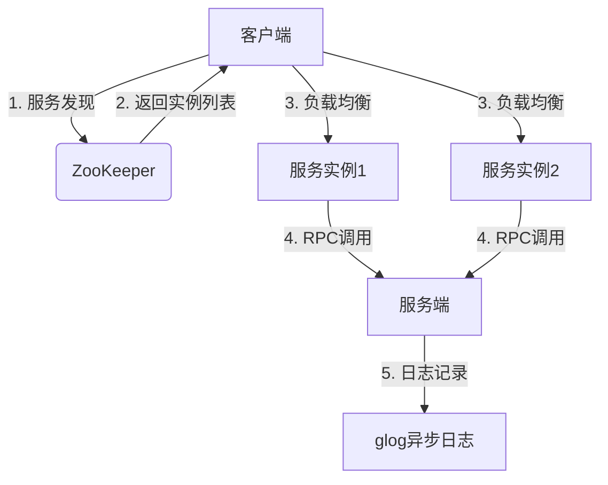

### **C++轻量级RPC框架技术路线**  
**目标**：基于Boost.Asio + ZooKeeper + JSON + glog，实现高并发、轻量级RPC框架，支持服务注册发现、负载均衡、动态代理和异步日志，可在单机开发环境完整运行。


### **一、技术选型与工具**
| 模块                | 技术方案                          | 理由                                                                 |
|---------------------|----------------------------------|----------------------------------------------------------------------|
| **网络通信**        | Boost.Asio                      | 跨平台异步IO，高效处理TCP长连接                                      |
| **序列化**          | nlohmann/json                   | 简单易用，支持复杂数据结构                                           |
| **服务注册发现**    | ZooKeeper（C客户端库）           | 分布式协调，支持动态服务发现和健康检测                                 |
| **日志系统**        | Google glog + 异步日志封装       | 高性能日志，支持日志分级和异步输出                                   |
| **负载均衡**        | 轮询/随机/一致性哈希             | 客户端集成策略，动态选择服务实例                                      |
| **动态代理**        | C++模板 + 宏定义                 | 零运行时开销，类型安全                                               |

---

### **二、项目架构设计**


---

### **三、核心模块实现步骤**  
#### **第1阶段：基础RPC通信（3天）**
1. **协议设计**  
   - 定义RPC协议头（魔数、消息ID、长度校验）  
   - 请求/响应体使用JSON序列化  
   ```cpp
   // rpc_protocol.h
   struct RpcHeader {
       uint32_t magic = 0x12345678;
       uint32_t body_len;
       uint32_t msg_id;
   };
   struct RpcRequest { ... }; // JSON序列化字段
   struct RpcResponse { ... };
   ```

2. **网络通信（Boost.Asio）**  
   - 实现异步TCP服务器/客户端  
   - 解决粘包问题（Header+Body模式）  
   ```cpp
   // 服务端异步读取
   async_read(socket, buffer(&header, sizeof(header)), [this](...) {
       async_read(socket, buffer(body, header.body_len), handleRequest);
   });
   ```

3. **集成glog日志**  
   - 封装异步日志输出类（避免阻塞主线程）  
   ```cpp
   class AsyncLogger {
   public:
       void log(const std::string& message) {
           std::lock_guard<std::mutex> lock(queue_mutex_);
           log_queue_.push(message);
           cond_.notify_one();
       }
   private:
       std::queue<std::string> log_queue_;
       std::mutex queue_mutex_;
       std::condition_variable cond_;
   };
   ```

---

#### **第2阶段：服务注册与发现（3天）**
1. **ZooKeeper集成**  
   - 使用C客户端库（如`zookeeper`或`cpp-zookeeper`）  
   - 实现服务注册接口  
   ```cpp
   void registerService(const std::string& service_name, const std::string& endpoint) {
       zoo_create(zk_handle_, "/services/CalculatorService/node", endpoint.c_str(), 
           endpoint.size(), &ZOO_OPEN_ACL_UNSAFE, ZOO_EPHEMERAL, nullptr, 0);
   }
   ```

2. **服务发现接口**  
   - 监听ZooKeeper节点变化，动态更新服务列表  
   ```cpp
   void watchServices(zhandle_t* zh, int type, const std::string& path) {
       if (type == ZOO_CHILD_EVENT) {
           updateEndpointList(path);
       }
   }
   ```

---

#### **第3阶段：动态代理与负载均衡（3天）**
1. **动态代理生成**  
   - 模板类封装远程调用，生成本地方法接口  
   ```cpp
   template <typename Service>
   class ServiceProxy : public Service {
   public:
       template <typename... Args>
       auto call(const std::string& method, Args... args) {
           RpcRequest req = buildRequest(method, args...);
           return client_.sendRequest(req);
       }
   };
   ```

2. **负载均衡策略**  
   - 实现轮询、随机、一致性哈希策略  
   ```cpp
   class LoadBalancer {
   public:
       virtual std::string selectEndpoint(const std::vector<std::string>& endpoints) = 0;
   };
   ```

---

#### **第4阶段：性能优化（2天）**
1. **连接池**  
   - 复用TCP连接，减少握手开销  
   ```cpp
   class ConnectionPool {
       std::queue<TcpConnection*> pool_;
       std::mutex mutex_;
   };
   ```

2. **线程池**  
   - 使用Boost.Asio的`io_context`线程池  
   ```cpp
   boost::asio::thread_pool pool(4); // 4线程
   ```

3. **零拷贝优化**  
   - 使用`string_view`减少序列化内存拷贝  

---

#### **第5阶段：测试与部署（1天）**
1. **单元测试**  
   - 使用Google Test验证协议、序列化、负载均衡逻辑  
   ```cpp
   TEST(RpcTest, BasicCall) {
       auto result = client.call("add", 3, 5);
       EXPECT_EQ(result, 8);
   }
   ```

2. **压测工具**  
   - 实现多线程压测客户端（模拟高并发场景）  
   ```bash
   ./benchmark --threads=100 --requests=10000
   ```

3. **Docker部署**  
   - 编写Dockerfile一键部署服务端、客户端、ZooKeeper  
   ```dockerfile
   FROM ubuntu:20.04
   RUN apt-get install -y libboost-all-dev libzookeeper-mt-dev
   ```

---

### **四、代码结构示例**
```
rpc-framework/
├── include/
│   ├── rpc_protocol.h    # 协议定义
│   ├── service_proxy.h   # 动态代理
│   ├── load_balancer.h   # 负载均衡策略
│   └── async_logger.h    # 异步日志
├── src/
│   ├── server.cpp        # 服务端主逻辑
│   ├── client.cpp        # 客户端主逻辑
│   └── zk_wrapper.cpp    # ZooKeeper封装
├── test/
│   ├── test_serialize.cpp # 单元测试
│   └── benchmark.cpp     # 压测工具
└── third_party/          # 依赖库
```

---

### **五、性能优化指标**
| 场景                | 目标QPS  | 优化手段                          |
|---------------------|---------|----------------------------------|
| 单线程同步调用       | 1,000+  | 连接复用 + JSON序列化优化          |
| 多线程异步调用       | 10,000+ | 线程池 + 零拷贝 + 内存池           |
| 服务发现延迟         | <10ms   | ZooKeeper长连接 + 本地缓存         |

---

### **六、扩展功能（可选）**
1. **熔断与降级**：基于错误率自动屏蔽故障节点  
2. **TLS加密**：Boost.Asio集成OpenSSL实现安全通信  
3. **跨语言支持**：通过IDL生成其他语言客户端  

---

通过此技术路线，你将在**两周内**完成一个高性能、轻量级的RPC框架，涵盖分布式系统核心功能。建议从基础通信模块开始，逐步扩展至高级功能，确保每一步通过单元测试验证。
